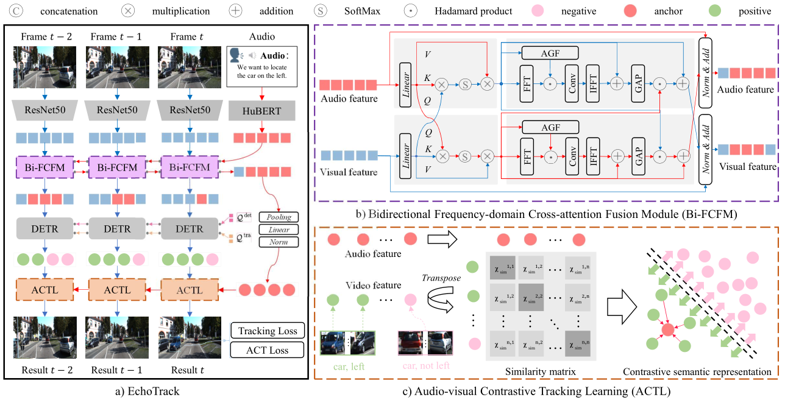

### 
 EchoTrack: Auditory Referring Multi-Object   Tracking for Autonomous Driving
 

  Jiacheng&nbsp;Lin*</a> <b>&middot;</b>
  Jiajun&nbsp;Chen*</a> <b>&middot;</b>
  Kunyu&nbsp;Peng*</a> <b>&middot;</b>
  Xuan&nbsp;He</a> <b>&middot;</b>
  Zhiyong&nbsp;Li</a> &middot;</b>
  Rainer&nbsp;Stiefelhagen</a> &middot;</b>
  <a href="https://yangkailun.com/" target="_blank">Kailun&nbsp;Yang</a>
     
  <a href="https://arxiv.org/pdf/2402.18302.pdf" target="_blank">Paper</a>

### Text-based AR-MOT benchmarks

#### Refer-KITTI

Please download Refer-KITTI from the official [RMOT](https://github.com/wudongming97/RMOT).

#### Refer-KITTI+

Based on Refer-KITTI, you can download json files [expression+](https://github.com/lab206/EchoTrack/files/15208490/refer-ktiit%2B.zip) to structure Refer-KITTI+ as below.

~~~
├── refer-kitti
│   ├── KITTI
│           ├── training
│           ├── labels_with_ids
│   └── expression+
│   └── seqmap_kittt+
~~~

#### Refer-BDD

We select 50 videos from [BDD100k](https://doc.bdd100k.com/download.html) tracking set as our training and validation videos. We put the entire dataset on [GoogleDrive](https://drive.google.com/drive/folders/12jXjL9wJ9keB-vD-kWKI8IzK6mrIfmAN?usp=sharing). The Refer-BDD are structured as below.

~~~
├── refer-bdd
│   ├── BDD
│           ├── training
│           ├── labels_with_ids
│   		├── expression
│   ├── refer-bdd.train
│   ├── seqmap_bdd
~~~

The `seqmap+`, `refer-bdd.train` and `seqmap_bdd` files are stored in the [assets](https://github.com/lab206/EchoTrack/tree/main/assets).

### Audio-based AR-MOT benchmarks

Please download Echo-KITTI from the asset files.

### Update

- 2025.6.8 Release AR-MOT benchmarks and model code.

- 2024.4.25 Release text-based AR-MOT benchmarks, including Refer-KITTI+ and Refer-BDD.

- 2024.2.29 Init repository.

### Abstract
This paper introduces the task of Auditory Referring
Multi-Object Tracking (AR-MOT), which dynamically tracks
specific objects in a video sequence based on audio expressions and appears as a challenging problem in autonomous
driving. Due to the lack of semantic modeling capacity in
audio and video, existing works have mainly focused on text-
based multi-object tracking, which often comes at the cost of
tracking quality, interaction efficiency, and even the safety of
assistance systems, limiting the application of such methods in
autonomous driving. In this paper, we delve into the problem
of AR-MOT from the perspective of audio-video fusion and
audio-video tracking. We put forward EchoTrack, an end-to-
end AR-MOT framework with dual-stream vision transformers. The dual streams are intertwined with our Bidirectional
Frequency-domain Cross-attention Fusion Module (Bi-FCFM),
which bidirectionally fuses audio and video features from both
frequency- and spatiotemporal domains. Moreover, we propose
the Audio-visual Contrastive Tracking Learning (ACTL) regime
to extract homogeneous semantic features between expressions
and visual objects by learning homogeneous features between
different audio and video objects effectively. Aside from the
architectural design, we establish the first set of large-scale AR-
MOT benchmarks, including Echo-KITTI, Echo-KITTI+, and
Echo-BDD. Extensive experiments on the established benchmarks
demonstrate the effectiveness of the proposed EchoTrack model
and its components.

